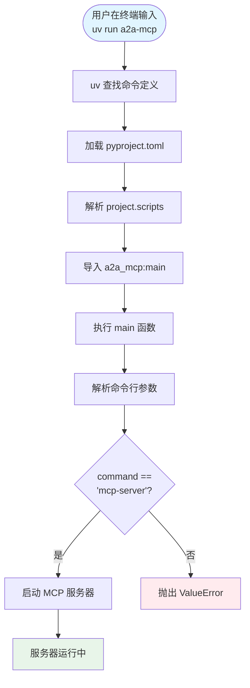
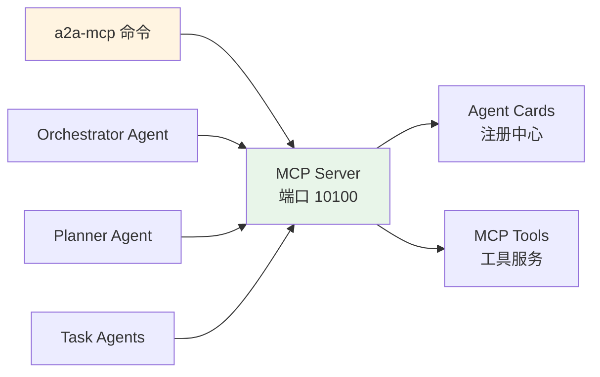

# a2a-mcp 命令详解

## 什么是 a2a-mcp？

`a2a-mcp` 是本项目的**命令行工具（CLI）**，用于启动和管理 MCP (Model Context Protocol) 服务器。它是项目的入口点，提供了便捷的方式来启动各种服务。

## 命名含义

- **A2A**: Agent-to-Agent（智能体间通信协议）
- **MCP**: Model Context Protocol（模型上下文协议）
- **a2a-mcp**: 结合 A2A 和 MCP 的示例项目

## 命令定义

### 在 pyproject.toml 中的配置

```toml
[project]
name = "a2a-mcp"
version = "0.1.0"
description = "A2A - MCP Sample"

[project.scripts]
a2a-mcp = "a2a_mcp:main"
```

**说明**:
- `[project.scripts]` 定义了可执行的命令行工具
- `a2a-mcp` 是命令名称（可以在终端直接调用）
- `"a2a_mcp:main"` 指向 `src/a2a_mcp/__init__.py` 中的 `main` 函数

### 工作原理

```python
# src/a2a_mcp/__init__.py
from a2a_mcp.common.mcp_server import serve

@click.command()
def main(command, host, port, transport) -> None:
    if command == 'mcp-server':
        serve(host, port, transport)
```

当你在终端输入 `a2a-mcp` 时：
1. Python 包管理器（如 `uv`）查找 `a2a-mcp` 命令
2. 找到 `pyproject.toml` 中定义的入口点
3. 调用 `a2a_mcp:main` 函数
4. 执行相应的服务器启动逻辑

## 使用方法

### 基本用法

```bash
# 使用默认配置启动 MCP 服务器
uv run a2a-mcp

# 等价于
uv run a2a-mcp --run mcp-server --host localhost --port 10100 --transport stdio
```

### 完整命令格式

```bash
uv run a2a-mcp [OPTIONS]
```

### 可用选项

| 选项 | 参数名 | 默认值 | 说明 |
|------|--------|--------|------|
| `--run` | `command` | `mcp-server` | 要运行的命令类型 |
| `--host` | `host` | `localhost` | 服务器绑定的主机地址 |
| `--port` | `port` | `10100` | 服务器监听的端口号 |
| `--transport` | `transport` | `stdio` | MCP 传输协议（stdio/sse） |

### 使用示例

#### 示例 1: 默认启动（开发环境）

```bash
cd <项目根目录>
uv run --env-file .env a2a-mcp --run mcp-server --transport sse --port 10100
```

**说明**:
- 使用默认主机 `localhost`
- 使用默认端口 `10100`
- 使用 SSE 传输协议（用于 HTTP 通信）

#### 示例 2: 生产环境配置

```bash
uv run a2a-mcp \
  --run mcp-server \
  --host 0.0.0.0 \
  --port 10100 \
  --transport sse
```

**说明**:
- `--host 0.0.0.0`: 允许所有网络接口访问
- `--port 10100`: 明确指定端口
- `--transport sse`: 使用 Server-Sent Events（适合 Web 集成）

#### 示例 3: 自定义端口

```bash
uv run a2a-mcp --port 10200
```

**说明**: 如果默认端口被占用，可以指定其他端口

#### 示例 4: 查看帮助

```bash
uv run a2a-mcp --help
```

## 命令执行流程



## 在项目中的作用

### 1. 启动 MCP Server

`a2a-mcp` 的主要作用是启动 MCP 服务器，该服务器提供：

- **Agent 注册中心**: 存储和管理 Agent Cards
- **Agent 发现服务**: 通过语义搜索找到匹配的 Agent
- **工具暴露**: 提供可复用的工具（数据库查询、地点搜索等）

### 2. 项目架构中的位置

```
用户/脚本
    ↓
a2a-mcp 命令 (CLI 入口)
    ↓
src/a2a_mcp/__init__.py (main 函数)
    ↓
src/a2a_mcp/common/mcp_server.py (serve 函数，MCP 服务器实现)
    ↓
MCP Server (运行在指定端口)
```

### 3. 与其他组件的关系



## 技术实现细节

### 1. 命令注册机制

**Python 包入口点（Entry Points）**:
- 在 `pyproject.toml` 的 `[project.scripts]` 中定义
- 安装包后自动注册为系统命令
- 使用 `uv` 或 `pip` 安装后可直接使用

### 2. Click 框架

使用 **Click** 库构建 CLI：
- 装饰器定义命令和选项
- 自动生成帮助信息
- 参数类型验证
- 错误处理

### 3. 模块导入路径

```python
# pyproject.toml 中定义
a2a-mcp = "a2a_mcp:main"

# 实际映射到
from a2a_mcp import main
# 或
from a2a_mcp.__init__ import main
```

## 常见使用场景

### 场景 1: 开发调试

```bash
# 启动 MCP 服务器，查看日志
uv run --env-file .env a2a-mcp --run mcp-server --transport sse --port 10100
```

### 场景 2: 自动化脚本

```bash
# 在 run.sh 或 run.ps1 中使用
uv run --env-file .env a2a-mcp --run mcp-server --transport sse --port 10100 > logs/mcp_server.log 2>&1 &
```

### 场景 3: Docker 容器

```dockerfile
# Dockerfile 中
CMD ["uv", "run", "a2a-mcp", "--host", "0.0.0.0", "--port", "10100", "--transport", "sse"]
```

### 场景 4: 多实例运行

```bash
# 实例 1
uv run a2a-mcp --port 10100

# 实例 2（不同端口）
uv run a2a-mcp --port 10200
```

## 命令选项详解

### --run / command

**作用**: 指定要运行的服务器类型

**当前支持**:
- `mcp-server`: 启动 MCP 服务器（默认）

**未来可能扩展**:
- `agent-server`: 启动 Agent 服务器
- `gateway`: 启动 API 网关
- `monitor`: 启动监控服务

### --host

**作用**: 指定服务器绑定的网络接口

**常用值**:
- `localhost` / `127.0.0.1`: 仅本地访问（默认）
- `0.0.0.0`: 所有网络接口（允许外部访问）
- 特定 IP: 绑定到指定网络接口

**选择建议**:
- 开发环境: `localhost`
- 生产环境: `0.0.0.0`（配合防火墙使用）

### --port

**作用**: 指定服务器监听的端口号

**默认值**: `10100`

**端口分配**:
- `10100`: MCP Server
- `10101`: Orchestrator Agent（使用 Gradio UI 时无需单独启动，编排器在 Gradio 进程内运行）
- `10102`: Planner Agent
- `10103`: Air Ticketing Agent
- `10104`: Hotel Booking Agent
- `10105`: Car Rental Agent

**注意事项**:
- 确保端口未被占用
- 避免使用系统保留端口（< 1024）
- 生产环境建议使用配置文件管理端口

### --transport

**作用**: 指定 MCP 传输协议

**可选值**:
- `stdio`: 标准输入输出（进程间通信）
- `sse`: Server-Sent Events（HTTP 通信）

**选择建议**:
- 本地开发/调试: `stdio`
- Web 集成/生产环境: `sse`

## 故障排除

### 问题 1: 命令未找到

```bash
# 错误: a2a-mcp: command not found
```

**解决方案**:
```bash
# 确保已安装项目依赖
uv sync

# 或使用 uv run（推荐）
uv run a2a-mcp
```

### 问题 2: 端口已被占用

```bash
# 错误: OSError: [Errno 98] Address already in use
```

**解决方案**:
```bash
# 使用其他端口
uv run a2a-mcp --port 10200

# 或查找并关闭占用端口的进程
# Windows
netstat -ano | findstr :10100
taskkill /PID <PID> /F

# Linux/Mac
lsof -i :10100
kill -9 <PID>
```

### 问题 3: 环境变量未设置

```bash
# 错误: OPENAI_API_KEY is not set
```

**解决方案**:
```bash
# 创建 .env 文件
echo "OPENAI_API_KEY=your_api_key_here" > .env

# 使用 --env-file 选项
uv run --env-file .env a2a-mcp
```

## 最佳实践

### 1. 使用环境变量

```bash
# 在 .env 文件中配置
MCP_HOST=localhost
MCP_PORT=10100
MCP_TRANSPORT=sse

# 在脚本中读取
export MCP_HOST=${MCP_HOST:-localhost}
uv run a2a-mcp --host $MCP_HOST
```

### 2. 日志管理

```bash
# 重定向日志到文件
uv run a2a-mcp > logs/mcp_server.log 2>&1 &

# 或使用系统日志
uv run a2a-mcp | tee -a logs/mcp_server.log
```

### 3. 进程管理

```bash
# 使用 nohup 后台运行
nohup uv run a2a-mcp &

# 使用 systemd（Linux）
# 创建服务文件 /etc/systemd/system/a2a-mcp.service
```

### 4. 健康检查

```bash
# 启动后检查服务状态
curl http://localhost:10100/health

# 或检查进程
ps aux | grep a2a-mcp
```

## 总结

`a2a-mcp` 是项目的核心命令行工具，它：

1. ✅ **简化启动流程**: 一行命令启动 MCP 服务器
2. ✅ **灵活配置**: 支持多种配置选项
3. ✅ **标准化接口**: 使用 Click 框架，符合 Python CLI 最佳实践
4. ✅ **易于扩展**: 预留了扩展其他服务的接口

通过 `a2a-mcp` 命令，开发者可以快速启动和管理 MCP 服务器，为整个多智能体系统提供 Agent 注册和工具服务。
