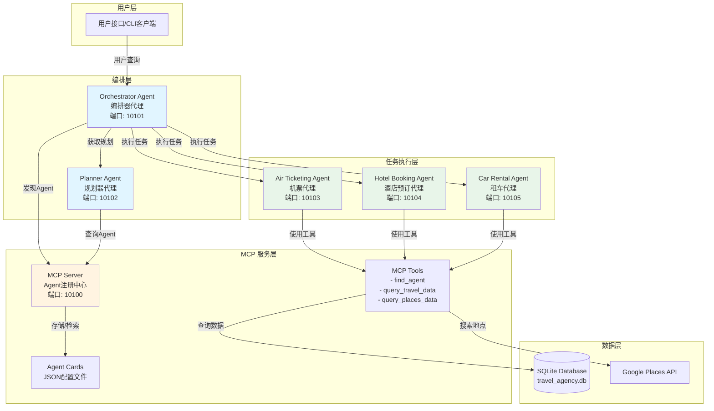
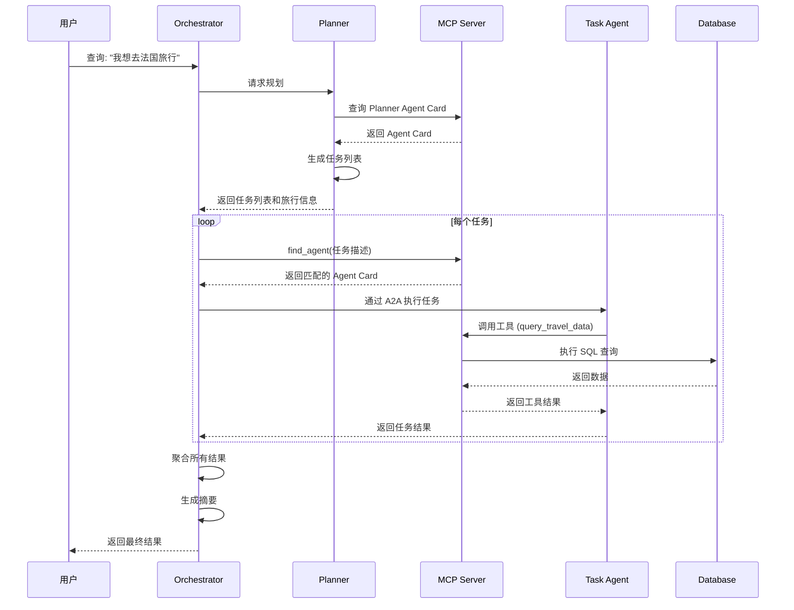
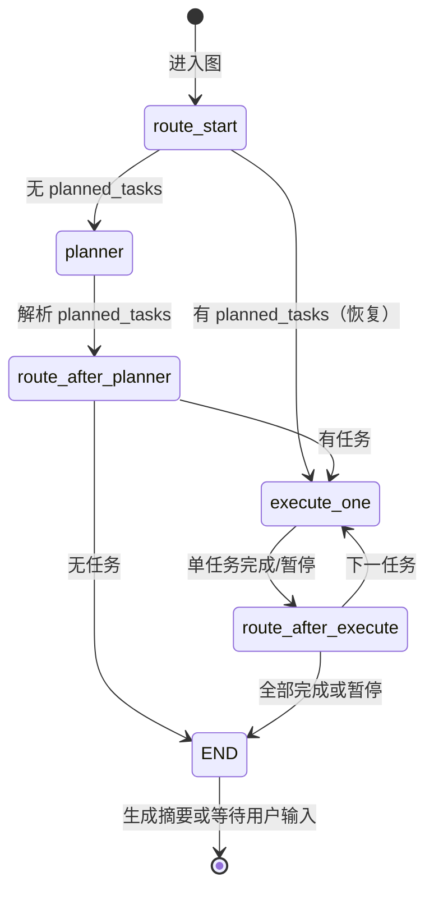

# 系统架构文档

## 概述

本项目是一个基于 **A2A (Agent-to-Agent)** 协议和 **MCP (Model Context Protocol)** 的多智能体旅行规划系统。系统通过 MCP 作为 Agent 注册中心，实现动态 Agent 发现和协作，完成复杂的旅行规划任务。

## 核心概念

### A2A 协议 (Agent-to-Agent)
- **Agent Card**: JSON 格式的 Agent 描述，包含身份、能力（actions/functions）和交互端点
- **消息格式**: 标准化的 Agent 间通信协议（如 `ExecuteTask`）
- **运行时通信**: Agent 之间的直接通信机制

### MCP (Model Context Protocol)
- **资源发现**: 标准化的工具、资源发现机制
- **Agent 注册中心**: 作为 Agent Cards 的集中存储和查询接口
- **工具暴露**: 提供可复用的工具（如数据库查询、地点搜索）

## 系统架构图



## 组件详细说明

### 1. 用户界面：Gradio Web 前端

**位置**: `src/a2a_mcp/gradio_app.py`

**职责**:
- 提供聊天式 Web 界面，用户输入旅行需求
- 编排器（OrchestratorAgent）在 Gradio 进程内实例化，通过 MCP 发现并调用 Planner 及各 Task Agent
- **交互体验**：使用生成器模式（`chat_sync` 生成器），点击发送后立即将用户消息加入对话框并清空输入框；等待 Agent 回复时显示「思考中...」，收到回复后替换为完整内容
- 端口 7860（可配置 `GRADIO_SERVER_PORT`），被占用时自动尝试 7861–7870

### 2. Orchestrator Agent (编排器代理)

**职责**:
- 接收用户查询并协调整个工作流
- 管理任务执行状态和依赖关系
- 聚合结果并生成最终摘要

**核心功能**:
- **工作流图管理**: 使用 **LangGraph StateGraph**（`agents/orchestrator/orchestration.py`）管理流程：planner → execute_one 循环 → END
- **动态任务调度**: 根据 Planner 返回的 `planned_tasks` 逐条执行，通过 MCP 发现对应 Task Agent
- **状态管理**: 跟踪 paused/resume、input_required 时先尝试自动回答（answer_user_question），能答则继续执行
- **结果聚合**: 收集所有任务 artifact，结束时生成 summary

**关键类/模块**:
- `OrchestratorAgent`: 主编排器类（`agents/orchestrator/`）
- `orchestration`: LangGraph 图定义与 `run_orchestration_stream`（`agents/orchestrator/orchestration.py`）

**端口**: 10101（使用 Gradio 时编排器在进程内运行，无需单独启动此服务）

### 3. Planner Agent (规划器代理)

**职责**:
- 将用户查询分解为结构化任务列表
- 提取旅行信息（预算、日期、目的地等）
- 生成可执行的任务序列

**技术实现**:
- 基于 **LangGraph StateGraph**（单节点 `plan` + 结构化输出）
- 使用 **OpenAI 兼容** 的 LLM（如 LiteLLM 配置的模型）
- 支持流式响应与 MemorySaver checkpoint（按 thread_id 恢复）

**输出格式**:
```python
TaskList {
    original_query: str
    trip_info: TripInfo {
        total_budget, origin, destination,
        start_date, end_date, travel_class,
        accommodation_type, room_type,
        is_car_rental_required, type_of_car,
        no_of_travellers, ...
    }
    tasks: List[PlannerTask] {
        id, description, status
    }
}
```

**端口**: 10102

### 4. MCP Server (Agent 注册中心)

**职责**:
- 存储和管理 Agent Cards
- 提供 Agent 发现服务（基于语义搜索）
- 暴露可复用的工具

**核心功能**:

#### 4.1 Agent 发现
- **`find_agent(query: str)`**: 基于嵌入向量相似度查找最相关的 Agent
  - 使用 `embedding-001` 模型生成查询和 Agent Card 的嵌入
  - 通过点积计算相似度
  - 返回最匹配的 Agent Card

#### 4.2 资源管理
- **`resource://agent_cards/list`**: 列出所有可用的 Agent Cards
- **`resource://agent_cards/{card_name}`**: 获取特定 Agent Card

#### 4.3 工具暴露
- **`query_travel_data(query: str)`**: 查询 SQLite 数据库
  - 执行 SELECT 查询
  - 返回航班、酒店、租车信息
  
- **`query_places_data(query: str)`**: 查询 Google Places API
  - 搜索地点信息
  - 返回地点详情

**端口**: 10100

### 5. Task Agents (任务执行代理)

所有任务代理均基于 **LangGraph + MCP 工具** 实现，**各 Agent 独立子包、互不共享**：`agents/air_ticketing/`、`agents/hotel_booking/`、`agents/car_rental/`，各自对应 AirTicketingAgent、HotelBookingAgent、CarRentalAgent。

#### 5.1 Air Ticketing Agent (机票代理)
- **职责**: 处理航班预订查询
- **工具**: 通过 **langchain-mcp-adapters** 从 MCP Server 加载 `query_travel_data` 等工具
- **端口**: 10103

#### 5.2 Hotel Booking Agent (酒店预订代理)
- **职责**: 处理酒店预订查询
- **工具**: 同上，使用 MCP 暴露的 `query_travel_data` 等
- **端口**: 10104

#### 5.3 Car Rental Agent (租车代理)
- **职责**: 处理租车预订查询
- **工具**: 同上
- **端口**: 10105

**共同特点**:
- 使用 **LangGraph `create_react_agent`** + 从 MCP（SSE）加载的工具
- **LiteLLM** 等 OpenAI 兼容接口作为 LLM
- 支持流式响应；可返回 `input_required` 向编排器/用户请求补充信息

## 数据流

### 典型执行流程



### 工作流状态机（LangGraph）



## 技术栈

### 核心框架
- **A2A SDK**: Agent-to-Agent 通信协议实现
- **LangGraph**: 编排器与 Planner 的 StateGraph、Task Agent 的 ReAct 图
- **FastMCP**: MCP 服务器实现
- **langchain-mcp-adapters**: 将 MCP 工具转为 LangChain 工具供 Task Agent 使用

### AI/ML
- **OpenAI 兼容 API**（如 LiteLLM）: 主要 LLM 调用
- **Embedding**: OpenAI 兼容接口（用于 MCP 端 Agent Card 语义搜索）

### 数据存储
- **SQLite**: 本地数据库 (`travel_agency.db`)
- **JSON Files**: Agent Cards 配置文件

### 通信协议
- **A2A Protocol**: Agent 间通信
- **MCP Protocol**: 工具和资源发现
- **SSE (Server-Sent Events)**: MCP Server 传输协议
- **HTTP/REST**: Agent 服务端点

### Python 库
- **httpx**: 异步 HTTP 客户端
- **pandas**: 数据处理（Agent Card 嵌入等）
- **numpy**: 数值计算（向量相似度）

## 关键设计模式

### 1. 注册中心模式 (Registry Pattern)
- MCP Server 作为 Agent 注册中心
- 支持动态 Agent 发现和注册
- 解耦 Agent 定义和执行

### 2. 编排模式 (Orchestration Pattern)
- Orchestrator 协调多个 Agent
- 管理任务依赖和状态
- 支持并行和串行执行

### 3. 工作流模式 (Workflow Pattern)
- 使用 **LangGraph StateGraph** 管理编排与规划流程
- 支持条件边（route_after_planner / route_after_execute）与循环（execute_one → 下一任务）
- 状态由 OrchestrationState 统一管理，支持暂停/恢复与自动回答

### 4. 工具模式 (Tool Pattern)
- MCP 工具作为可复用组件
- Agent 通过工具访问外部资源
- 统一的工具接口和调用机制

## 目录结构

```
a2a_mcp/
├── agent_cards/              # Agent 配置文件
│   ├── orchestrator_agent.json
│   ├── planner_agent.json
│   ├── air_ticketing_agent.json
│   ├── hotel_booking_agent.json
│   └── car_rental_agent.json
│
├── src/a2a_mcp/
│   ├── gradio_app.py         # Gradio Web 前端（编排器进程内运行）
│   ├── agents/               # Agent 实现
│   │   ├── __main__.py       # Agent 服务入口
│   │   ├── orchestrator/     # 编排器 Agent
│   │   ├── planner/          # Planner Agent
│   │   ├── air_ticketing/    # 机票 Agent
│   │   ├── hotel_booking/    # 酒店预订 Agent
│   │   └── car_rental/       # 租车 Agent
│   │
│   ├── common/               # 共享组件（基类、执行器、MCP 服务、utils）
│   │   ├── base_agent.py     # Agent 基类
│   │   ├── agent_executor.py # A2A 执行器
│   │   ├── mcp_server.py     # MCP 服务（agent cards、工具）；入口 a2a-mcp
│   │   └── utils.py          # 工具与 MCP 配置（ServerConfig、init_api_key 等）
│   │
│   └── agents/orchestrator/mcp_client.py  # 编排器用 MCP 客户端（发现 AgentCard、CLI 测试）
│
├── travel_agency.db          # SQLite 数据库
├── pyproject.toml            # 项目配置
└── README.md                 # 项目文档
```

## 扩展性

### 添加新的 Task Agent

1. **创建 Agent Card**: 在 `agent_cards/` 目录添加 JSON 配置文件
2. **实现 Agent**: 继承 `BaseAgent`，在 `agents/` 下新建独立子包（如 `agents/air_ticketing/`）
3. **注册到 MCP**: Agent Card 会自动被 MCP Server 加载
4. **启动服务**: 使用 `__main__.py` 启动新的 Agent 服务

### 添加新的 MCP 工具

1. **在 `common/mcp_server.py` 中添加工具函数**:
```python
@mcp.tool()
def my_new_tool(param: str) -> dict:
    """工具描述"""
    # 实现逻辑
    return result
```

2. **工具会自动暴露给所有连接的 Agent**

### 自定义工作流

- 修改 `agents/orchestrator/orchestration.py` 中的 StateGraph 节点与边
- 在 `OrchestratorAgent` 中调整对 `run_orchestration_stream` 的调用与状态解释
- 支持条件分支、循环（execute_one 循环）及后续扩展并行节点

## 安全考虑

⚠️ **重要**: 本示例代码仅用于演示目的。在生产环境中：

1. **输入验证**: 所有来自外部 Agent 的数据应被视为不可信
2. **Agent Card 验证**: 验证 Agent Card 的完整性和来源
3. **SQL 注入防护**: `query_travel_data` 仅允许 SELECT 查询
4. **API Key 管理**: 使用安全的密钥管理服务
5. **访问控制**: 实现适当的身份验证和授权机制

## 性能优化

1. **嵌入缓存**: Agent Card 嵌入在启动时预计算
2. **连接池**: 使用 httpx.AsyncClient 管理连接
3. **流式处理**: 支持流式响应，减少延迟
4. **并行执行**: 工作流支持并行任务执行

## 监控和日志

- 所有组件使用 Python `logging` 模块
- 日志级别可通过环境变量配置 (`A2A_LOG_LEVEL`, `FASTMCP_LOG_LEVEL`)
- 建议在生产环境中集成结构化日志和监控系统
