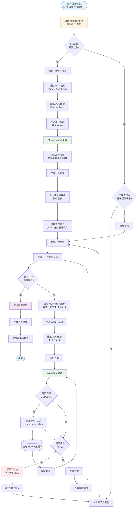
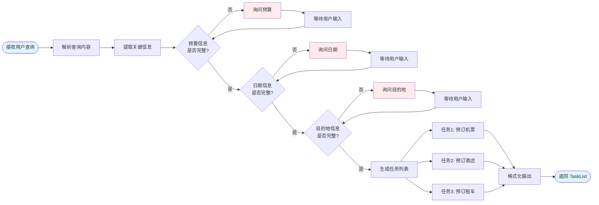
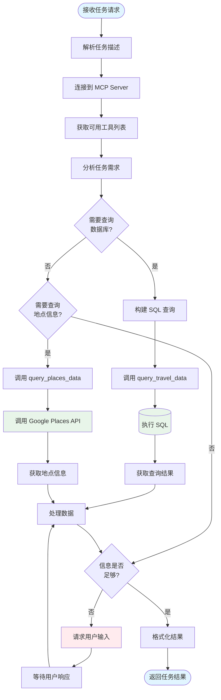
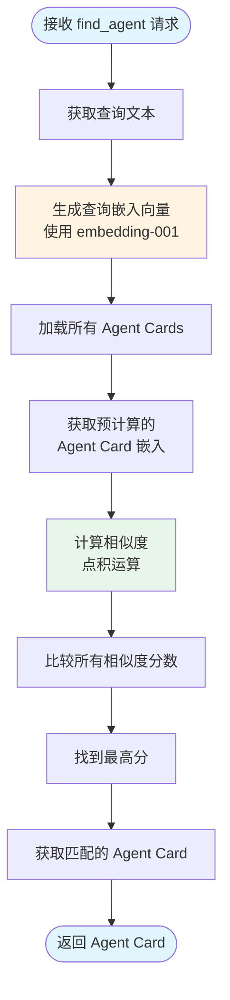
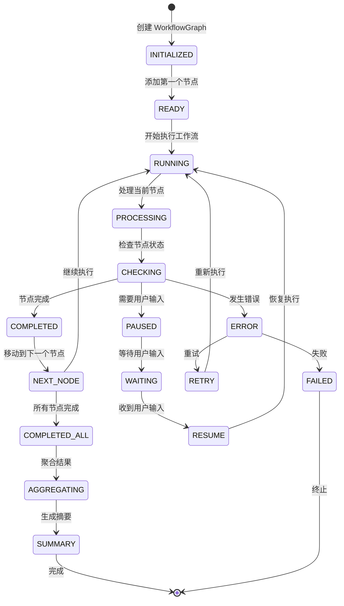
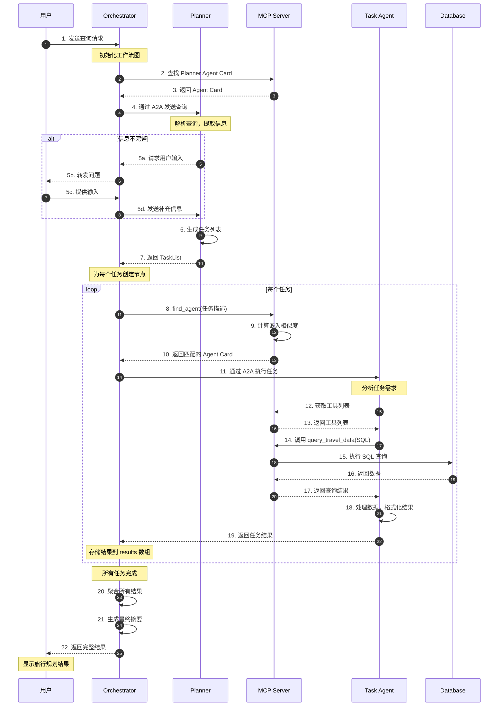
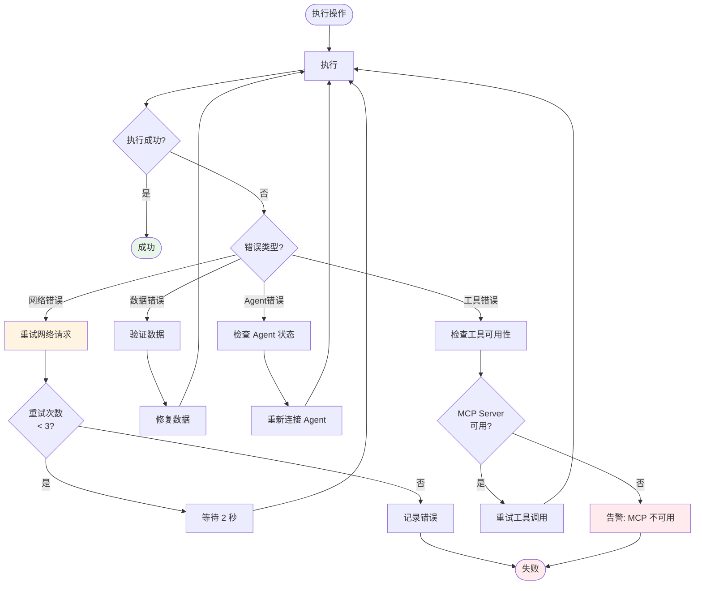
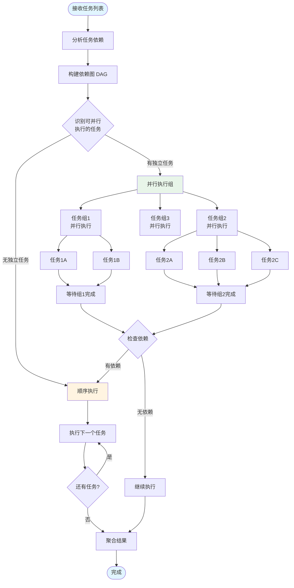
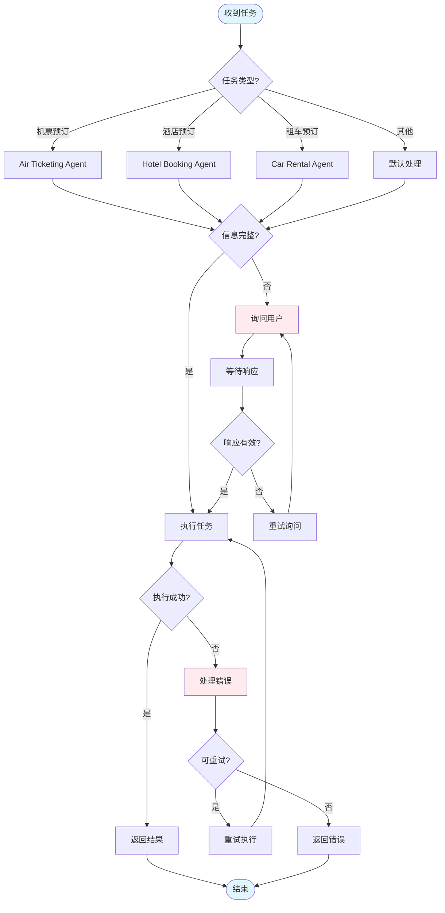
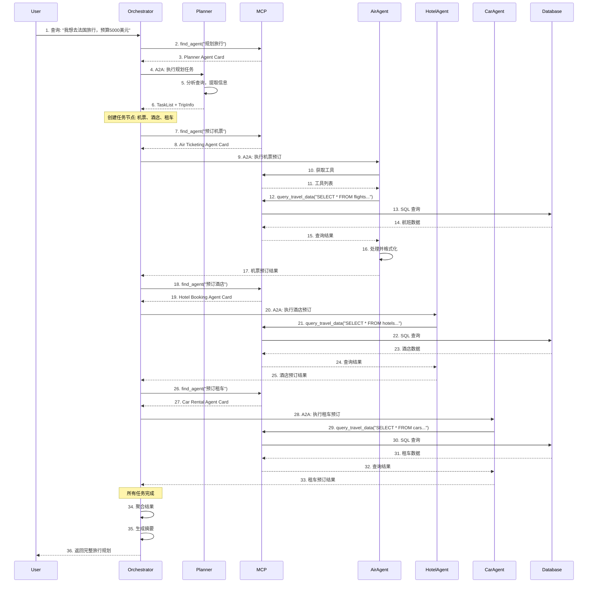

# 项目流程图

## 完整系统流程图

### 主流程图

## 详细子流程

### 1. Planner Agent 处理流程

### 2. Task Agent 执行流程

### 3. MCP Server Agent 发现流程

### 4. 工作流状态转换流程

### 5. 数据流详细图

### 6. 错误处理和重试流程

### 7. 并发执行流程（未来优化）

## 关键决策点

### 决策树：任务执行策略

## 时序图：完整交互流程

## 流程图说明

### 主要流程阶段

1. **初始化阶段**
   - Orchestrator 接收用户请求
   - 创建工作流图
   - 查找 Planner Agent

2. **规划阶段**
   - Planner 解析用户查询
   - 提取旅行信息
   - 生成任务列表

3. **执行阶段**
   - 为每个任务查找匹配的 Agent
   - 通过 A2A 协议执行任务
   - Task Agent 使用 MCP 工具查询数据

4. **聚合阶段**
   - 收集所有任务结果
   - 生成最终摘要
   - 返回给用户

### 关键特性

- **动态发现**: 通过 MCP 动态查找 Agent，无需硬编码
- **状态管理**: 工作流支持暂停、恢复、重试
- **错误处理**: 完善的错误处理和重试机制
- **用户交互**: 支持在流程中请求用户输入
- **可扩展性**: 易于添加新的 Agent 和工具
